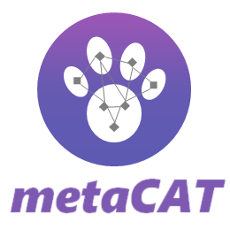
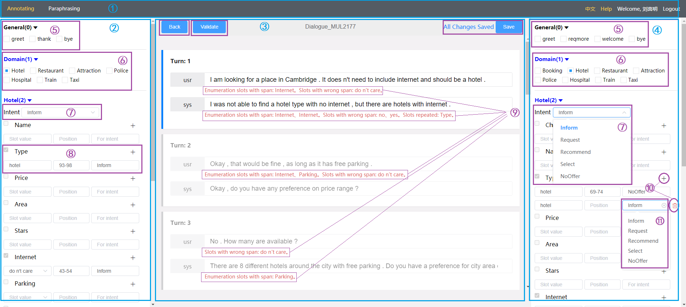
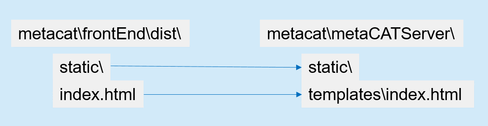

# metaCAT: A Metadata-based Task-oriented Chatbot Annotation Tool

## Overview
metaCAT is an open-source web-based annotation tool designed specifically for developing task-oriented dialogue data. metaCAT extends LIDA by contributing additional key useful features including:

1. comprehensive metadata annotation coverage to the domain, intent and span information w.r.t. each dialogue turn;
2. real-time annotation constraint-checking to ensure data quality;
3. ASR paraphrasing to speed up an annotator's data input process and increase the diversity of utterances.

We've released a short video clip for metaCAT at https://youtu.be/07_PWD4_c4E.

## Main GUI


## Metadata
Metadata is a segment of data used to describe the dialogue domain, intention, and slot annotation system. It is stored in JSON format and determines the optional service domains on the user side and system side, slots in each service domain, valid slot-values in each slot, and allowed intents.

**General**: This type of domain contains only some intent without actual slots, such as "Thank" and "Bye", etc.

**Service Domain**: These types of domain contain some specific intents with slots, e.g. "Hotel" and "Restaurant". Generally, a dialogue involves one service domain. However, in a few cases, it may involve two service domains, e.g. "Hotel" and "Taxi".

**Intent**: It represents the intent expressed in each utterance. It is possible that one utterance contains multiple intents.

**Slot**: It indicates the key information carried by the intent. Non-enumerated slots are usually one word or short segment of text taken from the original utterance text. Enumerated slots only have some specific slot-values and may not appear in the utterance text of the dialogue.

## Technology Selection 

The system frontend and backend are independently developed. The backend provides RESTful services through the Flask. The frontend uses the vue.js framework for development, and MongoDB as storage. 

The component version list is as following: 
Python3.6/Vue 2.5.2/MongoDB 4.2.0. 


## Operating Environment Requirements 

MongoDB is used for data storage, and Python3 is used for system running program. 


### MongoDB Settings 

MongoDB User Settings 

```
use metacat
db.createUser({user:'metacat',pwd:'metacat',roles:[{role:"readWrite",db:"metacat"}]})
db.auth("metacat", "metacat")
db.metacat.insert({"name":"metaCAT annotation"})
```

In the code, the MongoDB connection is configured in [utils/mongo_util.py]. 

```python
client = MongoClient("mongodb://xxx.xxx.xxx.xxx:27017")
db = client['metacat']
db.authenticate('metacat', 'metacat')
```

### Front end compiling 

User can compile frontend by following scripts:
```
(metaCATServer)$ cd frontEnd/
(metaCATServer)$ npm install
(metaCATServer)$ npm run build
```
When "dist" folder is created, please do as following to perform the operations



If npm running environments not installed, please unzip dist.zip, and perform the above operations.


### System Startup 

Server IP address and port number, which should be configured in the meta_cat_server.py file in advance. 
```
(metaCATServer)$ virtualenv -p python3.6 metaCATServerEnv
(metaCATServer)$ source metaCATServerEnv/bin/activate

(metaCATServer)$ cd metaCATServer/
(metaCATServer)$ pip3 install -r requirements.txt
(metaCATServer)$ python meta_cat_server.py
```

### Administrator Account

The default password for the system administrator account is "Administrator/SuperUser". 

### System Access 

Open Chrome and access the URL http://FlaskServerIP:Port. 

### ASR Service Integration 

By default, the front-end can collect WAV speech input, but no ASR service is integrated at the backend. 
If you need to use ASR service, you can implement the class of ASRRecognizer by integrating 3rd ASR service or plug-in.
The following code is from [blueprints.audio_recognition.py]. 
```python
@asr_bp.route("/audio_recognize", methods=['POST'])
def handle_audio_recognize():
    audio = request.form['audio']
    audio_content = 'No ASR service integration by default '

    # Audio files can be output if debugging is required. 
    # export_audio(audio)

    # recognizer = ASRRecognizer()  # Initialize the recognizer. 
    # audio_content = recognizer.audio_recognize(audio)  # Send an identification request. 

    result = {
        "data": audio_content
    }
    return jsonify(result)
```
